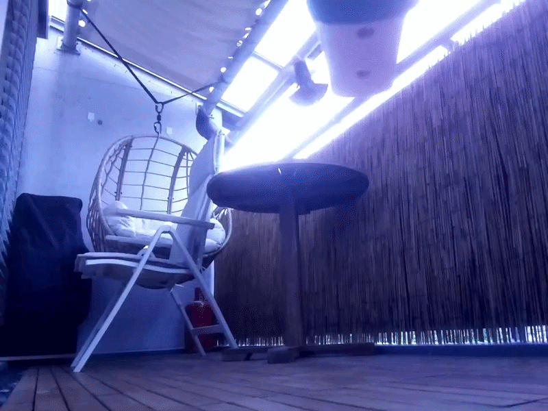
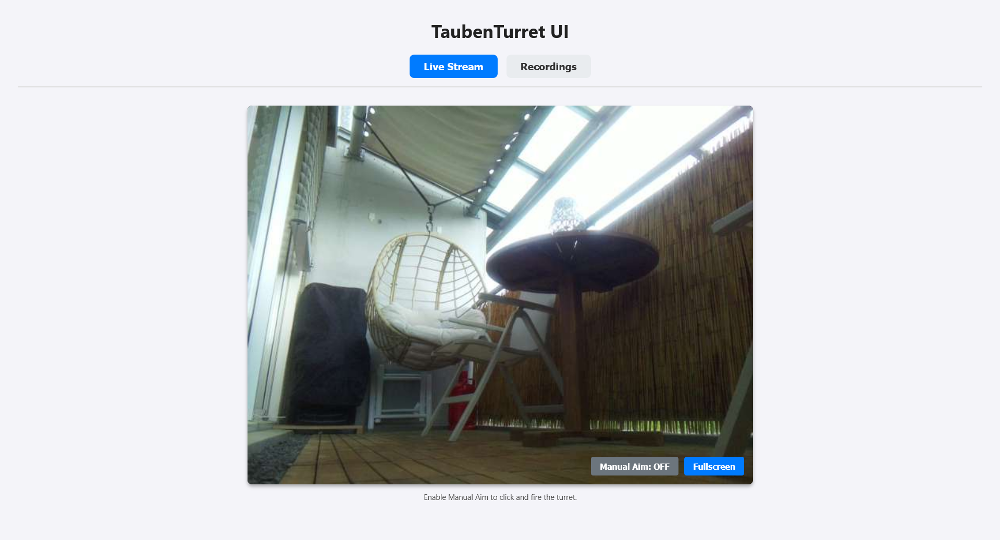
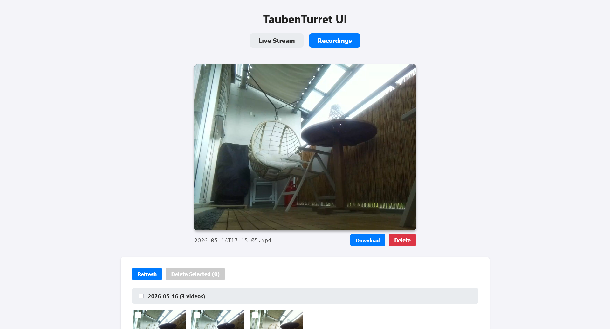

# taubenturret

Control software for the [TaubenTurret system](https://makerworld.com/de/models/2801562-taubenturret-automated-pigeon-deterrent): An automated, computer vision driven water turret system for targeted pigeon deterrence.

## Demo & Screenshots

<p align="center">
  
</p>
<p align="center">
  
  
</p>

## Features
* **Automated Targeting:** Uses a Raspberry Pi Camera to detect motion, triggering an external AI object detection API to identify pigeons.
* **Pan/Tilt Control:** Calculates 3D physical angles from 2D pixel coordinates to smoothly aim the watergun via PWM-controlled servos.
* **Web Interface:** Includes a built-in FastAPI web UI for viewing the live MJPEG stream, manual firing, and browsing recorded video clips.
* **Auto-Recording:** Captures and saves `.mp4` video events whenever motion is detected.

## Hardware Requirements
* 3D models and hardware list available [on makerworld](https://makerworld.com/de/models/2801562-taubenturret-automated-pigeon-deterrent).  

## Software Dependencies
* Python 3.9+ 
* `make` and `uv` for environment management.
* An active external object detection backend API: [taubenturret-backend](https://github.com/MLWeber/taubenturret-backend) 
* Required Python packages: `fastapi`, `uvicorn`, `opencv-python` (`cv2`), `numpy`, `requests`, and `picamera2`.

## Configuration
First, create your local environment configuration file by copying the provided template:
```bash
cp .env.example .env
```
Before running the system, make sure your properties in the `.env` file are set up correctly. Important settings to verify:
* **Webserver Auth:** `WEBSERVER_USERNAME`, `WEBSERVER_PASSWORD`, and `WEBSERVER_PORT`.
* **AI Endpoint:** `DETECTOR_API_URL` to point to your external detection API.
* **Hardware Tuning:** Validate your `SERVO_PAN_*`, `SERVO_TILT_*`, and `WG_*` constants to ensure your servos don't over-rotate and the watergun relay timings are safe.
* **Storage:** Ensure `RECORD_DIRECTORY` points to a valid path where the Pi can save video files.

## Installation
Use the provided `Makefile` to quickly set up the environment and install dependencies:
```bash
make setup
make install
```

## Usage
Start the main control loop by running:
```bash
make run
```
Once running, you can access the dashboard by navigating to `http://<raspberry-pi-ip>:<webserver-port>` in your browser and logging in with your HTTP Basic Auth credentials.
